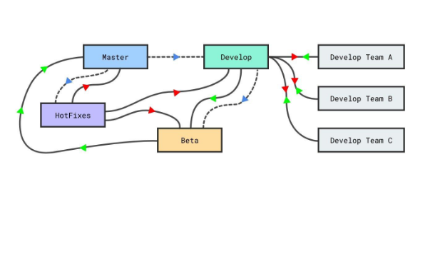
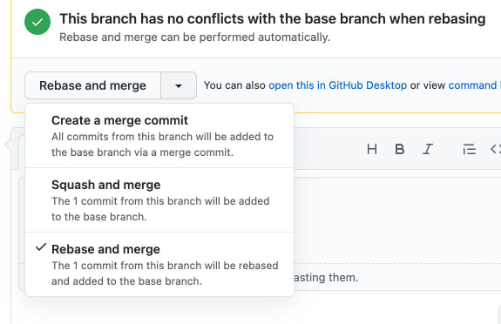
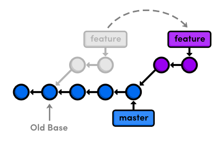
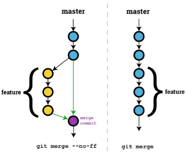
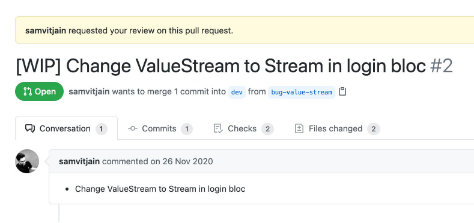

# VCS (Git) Branching Model

#### Created: 15 Jan 21
#### Updated: 16 Jan 21

#### Author: Ayush P Gupta [@apgapg](https://github.com/apgapg)
#### Edited: --


## OVERVIEW

Introduce the new proposed Git branching model for different FA project repositories.

## GOALS

1. Clean commit history
1. Hassle free Pull Request(PR) merging, reviewing and reverting
1. Proper changelogs and release history with release versions
1. Proper manage the working of different tech teams and their work sync and merge thereafter.
1. Make code more stable and prevent merge conflicts at PR review time and bugs in release
1. Follow best practices as stated in this document

## BACKGROUND & MOTIVATION

### CURRENT SYSTEM

After rounds of discussions, following problems were found:

1. Code commit history isn’t readable. One cannot go back and drill down about any feature, bug start/merge.
2. It was difficult to cherry pick due to multiple line history
3. Difficult to identify who did what work and when and how his/her work got merged.
4. Innumerous merge conflicts ultimately leading to difficulty in reviewing PR thereby leading to unstable code after merge
5. Lack of proper commit message leads to difficulty in purpose of commit/PR
6. Improper branch naming causes lack of understanding to other team members
7. With growing members in team the situation is becoming more worse leading to crashes and down of our publishes

### NEW SYSTEM

Drilling down and after brainstorming we came with our new Git Branching model which solves most of the problems and provides more stable and reliable releases to our end users.

1. We see people using **merge** instead of **rebase.** Although one should wisely use both but sticking to only **merge** can cause non-linear commit history thereby reducing readability. Using **rebase** one can reduce the conflict scenario and can maintain linear history
2. When we have linear history it's easy to identify the work done by individuals and better track different bugs/features origin.
3. Linear history would enable us to cherry pick commits easily.
4. With proper commit message/branch naming  standards we can easily identify the purpose of commit and subsequent PR

## OVERVIEW OF NEW SYSTEM



The new branching model is an enhanced version of [Git-flow](https://nvie.com/posts/a-successful-git-branching-model/) that tries to solve the previous diagnosed issues by defining different branches as below:

### master

Widely known, master(main) branch is the **most stable branch** that directly reflects the work on **production.** Since this branch is a reflection of production hence no member is directly allowed to work on it. Here are some important points to remember:

1. Master reflects the latest work on production/manage.
2. No direct commits/working on this branch is allowed.
3. No force push is allowed
4. Can receive merge requests only from hotfix, release(beta) branch.
5. The commit just after merge commit **must be a release commit.**
6. This branch should not be merged into any other branch.

### develop

The develop branch reflects the latest development work which is already tested by individuals. But being on the bleeding edge things can be broken. Here are some important points to remember:

1. No direct commits/working on this branch is allowed. Even admins should take out a branch and raise PR instead of directly commiting on this branch.
2. All the other development related branches must periodically rebase on this branch.

### beta(release)

These branches represent the beta environment or release branch. The idea here is to prepare for the next release that upon testing and passing QA will be merged into master.

Here are some important points to remember:

1. Must be taken out only from develop branch
2. No direct commits/working on this branch is allowed.
3. This branch must be kept in sync with the develop branch until this is merged.
4. Hotfixes branches also get merged into this branch.
5. After QA passing this branch will get merged into the master branch. Post which the branch existence will come to an end i.e. it will  be deleted.
6. Any bug fixes detected in this branch must come from develop branch.

### hotfixes

These branches represent the adhoc critical bug fixes that need to be fixed on master. These are short lived branches and must have minimum commits and fixes that are needed to prevent the critical bugs. Ideally no features must be included.

Here are some important points to remember:

1. Must originate from the master branch from its latest commit.
2. After work is done this branch must be merged to **master, beta(if any), develop.**
3. Must contain release commit before merging.
4. This branch must not be rebased or get rebased by any other branch. Must merge by no-ff option on develop.

### Team’s develop branches

These branches originate from develop branch for respective team workings. These can be referred to **develop branch** for individual teams.

## USE CASES

### Scenario-1 : Start of sprint AA

Let’s say we currently have only two branches **master, develop**. There are new task assigned to different teams A, B, C. Here is how to proceed:

1. Each Team lead will take out their respective develop branch from **develop** branch. 

```
develop

    -- sprint-AA/develop-team-A -- sprint-AA/develop-team-B
```

2. The individual team members will now take out respective branches from their **individual team develop branch**. Do not forget to use prefix while naming your local branch like **bug/** , **dev/ .** This helps others to understand the scope of the branch. Keep the existence of local branch short and meaningful.

```
develop-team-A 

    -- sprint-AA/team-A/bug/fix-null-in-report 
    -- sprint-AA/team-A/feature/beat-o-meter
```

3. After completion of work, one should rebase their branch on their team’s develop. This will make work to replay on top of the team's develop. Remember not to have any merge commit in your work. Finally raise PR on their team’s develop describing briefly about the work and other changes via PR template.
4. The team lead would review the PR and merge it via **rebase and merge(ff) option.** This will ensure no merge commits/conflicts are there and the linear history is preserved.
5. Upon completion of work on the individual team, the team would **rebase the team branch on-to develop**. This ensures all team work is replayed to the latest develop. Also this preserves linear history. Finally PR is raised to develop and get it merged.
6. The team lead must periodically rebase their **team’s develop branch on-to develop** and force push their branch.

### Scenario-2 : Completion of sprint AA

1. The develop branch is now at the latest with all the changes  from different teams, sprint. The admin would now take out a branch from latest develop and name it **release/sprint-AA.** This will now be manually published to the demo/beta environment and passed to the QA team for final testing.
2. Let’s say some bug crept in after QA analysis. The concerned team lead would then need to take out a branch from **develop** and raise PR to develop again after work is done/bugs fixed.
3. After final testing the release branch would then be **merged to the master branch and post that it is deleted.**
4. Once the release branch is merged to master, the respective team develop branch **is then deleted.**
5. **develop branch will not be updated with next sprint** changes until release branches are merged into master branch

### Scenario-3 : Start of sprint BB

We know the above release process may take a little time and meanwhile the next sprint can start. Hence in order to start the new sprint work, again the team lead will take out a new branch from develop:

```
develop

    -- dev/team-A/sprint-BB 
    -- dev/team-B/sprint-BB
```

And the process will continue, without hampering the previous sprint branches anywhere.

### Scenario-4 : Hotfixes

Consider that after the sprint has been released, some critical bug crept in which needs to be fixed urgently. We can classify these bugs into two categories:

**1. Hotfix Type 1 (Urgent Fix)**

These are critical and known bug which the admin thinks need to be tested by the team once fixed and he is confident in the fix.

To fix this admin would take out a branch:

```
master

    -- hotfix/v2.x.y
```

**2. Hotfix Type 2 (Bug Fix)**

These are similar to hotfix type 1 bugs but which need to be checked and passed by the QA team. The process of fix is similar to hotfix type 1 just to be approved by the team.

Once the bug is fixed on the particular hotfix branch, the admin would then need to merge it back into master and develop branch via no-ff merge in develop branch. Here the develop branch might have moved forward  due to next sprint changes getting merged, but that won’t create issues as hotfix merging would create a merge commit (an exception to the rule of linear commit history).

### Merging Pull Request (PR)

Pull request can be merged by admins in three ways (actually there are four, but we shall not describe squash commit technique). Either by **ff merge, no-ff merge, rebase and merge.**

**no-ff merge** is used while merging hotfix branches so as to preserve merge history.

**Rebase and merge** is the most general way to merge PR into develop branches. This preserves linear history and prevents any merge commits while accepting PRs.

Hence all team members will use **Rebase and merge** option when merging PR of individual members into their respective team develop branch.



## BEST PRACTICES

### Branch Naming

Proper branch naming conventions must be used for development related work in team.

**[sprint-name]   -  [team name]  -  [work type]  -  [exact context]**

For example:

```
sprint-AA/team-A/bug/fix-null-in-report

sprint-BB/team-A/feature/push-notification 
```

This will ensure anyone in the team can draw out which branch corresponds to what. This will help admin to organize the branches and work.

If we religiously follow the above pattern we would have a pretty organized structure as below. Each sprint has its own enclosing folder and each team has its own folder inside a sprint.

Looks awesome?


###Commit Message

Proper commit message should be entered while committing your work. Your commit message should follow following standards:

1. Commit message should have a prefix indicating the feature/highlight of the nature of work in commit. For example:


This will clearly indicate what commit message corresponds to what feature/bug in commit history. Helpful after merge and releases are complete.

2. Commit messages must be **imperative**, like giving an order to do so and so thing.
3. Use present tense instead of past tense. Don’t use Added, Fixed instead use Add, Fix.

### Release Commits

Every merge to either **develop** or **master** must have the latest commit as **Release Commit.** This release commit comprises of two changes only:

**1. Version Bump:** Increase in build version eg v2.5.4 to v2.5.5 or v2.6.0 in accordance with [semantic versioning](https://travishorn.com/semantic-versioning-with-git-tags-1ef2d4aeede6).

**2. Change log:** Updating corresponding CHANGELOG.md with what happened after the last commit message.

```
## [125.6.4] 14/01/21

- [TourPlan] Show beat if reason is empty. 
- [Alerts] Show notification dialog when app is in foreground. 
- [Filters] Fix text overflow in filters. 

## [125.6.3] 14/01/21 

- [TourPlan] Don't show reason if empty.** 
```

3. Even the hotfix branch must include Release Commit and update the CHANGELOG.md in it accordingly.
```
## [125.2.5] (Hotfix) 19/12/20

- Change valueSteam to Stream 

## [125.3.1] 18/12/20

- [Team Coverage] Fix data loading bug by adding WidgetKey
```


### Rebase

**Rebasing** is a process to reapply commits on top of another base trip. This must be done regularly or just before raising PR to the base branch.



In the above figure, the feature branch is no more with latest changes in master because some other members did work on master. Hence to have linear git history and prevent merge conflicts feature branch is **rebased on-to master** so as to make its commit appear **on top of the latest master.**

```
$ git checkout experiment    // your local branch

$ git rebase master          // The branch on which you will raise PR
```

**ff (Fast forward) merge vs no-ff  merge**



Feature branches can be merged in two ways. Either by **ff-merge** or by **--no-ff merge.** No ff merge would create **merge commit** while maintaining the history of merge. This is helpful when merging **hotfix branches** where merge history is required.

On the other hand, **ff merge** would simply merge the feature branch on-to master branch (provided feature is at latest with master). This is helpful when we require linear history and are not interested how it got merged.

**WIP tag in PR (Work in progress. Do not review)**

Sometimes code related or code review type discussions are needed with other members, hence often we add a prefix **WIP** to the title of PR. Such PR should not be merged as the work is still in progress. Once the WIP thing is over, the author of PR must remove the WIP prefix to get it reviewed & merged.



## FURTHER READING

1. <https://nvie.com/posts/a-successful-git-branching-model/>
2. <https://travishorn.com/semantic-versioning-with-git-tags-1ef2d4aeede6>
3. <https://www.atlassian.com/git/tutorials/comparing-workflows/gitflow-workflow>
4. <https://git-scm.com/book/en/v2/Git-Branching-Rebasing>
